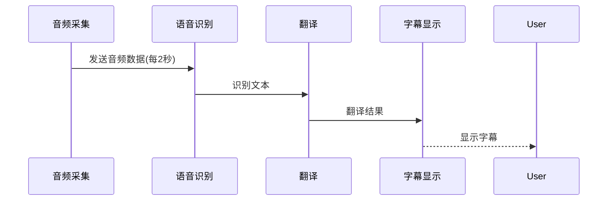

# 实时字幕翻译应用超详细开发指南

## 1. 基础概念解释

### 1.1 什么是实时字幕翻译？


### 1.2 核心组件说明
| 组件 | 作用 | 技术实现 |
|------|------|----------|
| 音频采集 | 录制电脑播放的声音 | PulseAudio/SoundCard |
| 语音识别(ASR) | 将语音转为文字 | Whisper模型 |
| 文本翻译 | 将文字翻译为目标语言 | Helsinki-NLP模型 |
| 字幕显示 | 在屏幕上展示字幕 | PyQt5 |

## 2. 环境准备（详细步骤）

### 2.1 硬件要求
- NVIDIA显卡（推荐GTX 1060以上）
- 至少8GB内存
- 麦克风（可选）

### 2.2 软件安装
```bash
# 1. 创建Python虚拟环境
python -m venv venv
source venv/bin/activate

# 2. 安装基础依赖
sudo apt install portaudio19-dev python3-dev

# 3. 安装Python包
pip install torch torchaudio --index-url https://download.pytorch.org/whl/cu118
pip install sounddevice numpy PyQt5 transformers openai-whisper
```

### 2.3 验证安装
```python
import torch
print(torch.cuda.is_available())  # 应该输出True
```

## 3. 模块实现详解

### 3.1 音频采集模块（audio_capture.py）
```python
import sounddevice as sd

class SystemAudioCapture:
    def __init__(self, samplerate=16000, blocksize=1024):
        """
        samplerate: 采样率(Hz)
        blocksize: 每次采集的样本数
        """
        self.samplerate = samplerate
        self.blocksize = blocksize
        self.stream = None

    def start_stream(self, callback):
        """启动音频流
        callback: 处理音频数据的回调函数
        """
        self.stream = sd.InputStream(
            samplerate=self.samplerate,
            blocksize=self.blocksize,
            channels=1,  # 单声道
            dtype='float32',
            callback=callback
        )
        self.stream.start()
```

### 3.2 语音识别模块（asr_processor.py）
```python
from transformers import pipeline
import torch

class WhisperASR:
    def __init__(self, model_size="large-v3"):
        """加载Whisper模型
        model_size: 模型大小(tiny, base, small, medium, large-v3)
        """
        self.pipe = pipeline(
            "automatic-speech-recognition",
            model=f"openai/whisper-{model_size}",
            device="cuda" if torch.cuda.is_available() else "cpu"
        )
    
    def transcribe(self, audio_np, sample_rate=16000):
        """将numpy音频数组转为文字"""
        result = self.pipe(
            {"array": audio_np, "sampling_rate": sample_rate},
            batch_size=8  # 批处理提高效率
        )
        return result["text"]
```

## 4. 完整工作流程

### 4.1 初始化阶段
1. 创建GUI窗口
2. 加载ASR模型（约2-5分钟）
3. 加载翻译模型
4. 初始化音频采集

### 4.2 实时处理流程


## 5. 性能优化指南

### 5.1 GPU加速配置
1. 确保安装正确版本的CUDA:
```bash
nvcc --version  # 应显示CUDA 11+
```

2. 使用TensorRT加速:
```bash
pip install tensorrt
```

3. 启用混合精度:
```python
model = whisper.load_model("large-v3").half()
```

### 5.2 内存优化
```python
# 在初始化时添加
torch.backends.cudnn.benchmark = True
torch.set_num_threads(4)
```

## 6. 常见问题解决

### 6.1 没有声音输入
```bash
# 检查音频设备列表
python -c "import sounddevice as sd; print(sd.query_devices())"

# 如果找不到设备，安装PulseAudio
sudo apt install pulseaudio
```

### 6.2 CUDA不可用
```python
# 检查CUDA状态
import torch
print(torch.version.cuda)  # 应该显示CUDA版本
print(torch.cuda.is_available())  # 应该为True
```

## 7. 完整代码实现

### 7.1 主程序 (main.py)
```python
import sys
import threading
import numpy as np
from src.audio_capture import SystemAudioCapture
from src.asr_processor import WhisperASR
from src.translator import SubtitleTranslator
from src.gui import SubtitleGUI
from PyQt5 import QtWidgets
from PyQt5 import QtCore

class LiveSubtitleApp:
    def __init__(self):
        self.gui = SubtitleGUI()
        self.asr = WhisperASR()
        self.translator = SubtitleTranslator()
        self.audio_buffer = []
        self.buffer_lock = threading.Lock()
        self.samplerate = 16000
        self.blocksize = 1024
        self.capture = SystemAudioCapture(samplerate=self.samplerate, blocksize=self.blocksize)
        self.running = True

    def audio_callback(self, indata, frames, time, status):
        # indata: (blocksize, channels)
        mono = indata.mean(axis=1) if indata.shape[1] > 1 else indata[:,0]
        with self.buffer_lock:
            self.audio_buffer.append(mono.copy())

    def process_audio(self):
        # 每2秒处理一次音频
        chunk_samples = self.samplerate * 2
        while self.running:
            QtCore.QThread.msleep(500)
            with self.buffer_lock:
                if len(self.audio_buffer) * self.blocksize >= chunk_samples:
                    audio_np = np.concatenate(self.audio_buffer)[:chunk_samples]
                    self.audio_buffer = []
                else:
                    continue
            try:
                text = self.asr.transcribe(audio_np, sample_rate=self.samplerate)
                zh_text = self.translator.translate(text)
                self.gui.update_subtitle(f"{text}\n{zh_text}")
            except Exception as e:
                self.gui.update_subtitle(f"[错误] {e}")

    def run(self):
        self.capture.start_stream(self.audio_callback)
        threading.Thread(target=self.process_audio, daemon=True).start()
        self.gui.show()

if __name__ == '__main__':
    app = QtWidgets.QApplication(sys.argv)
    live_app = LiveSubtitleApp()
    live_app.run()
    sys.exit(app.exec_())
```

## 8. 配置参数说明

### 8.1 主配置参数
| 参数 | 默认值 | 说明 |
|------|--------|------|
| samplerate | 16000 | 音频采样率(Hz) |
| blocksize | 1024 | 每次处理的音频样本数 |
| model_size | large-v3 | Whisper模型大小 |
| target_lang | zh | 目标翻译语言代码 |

### 8.2 性能相关参数
```python
# 在main.py中调整这些参数
CHUNK_DURATION = 2.0  # 每次处理的音频时长(秒)
PROCESS_INTERVAL = 0.5  # 处理间隔(秒)
```

## 9. 扩展开发指南

### 9.1 添加新语言支持
1. 在translator.py中添加:
```python
from transformers import pipeline

class SubtitleTranslator:
    def __init__(self):
        self.en2zh = pipeline("translation", model="Helsinki-NLP/opus-mt-en-zh")
        self.en2ja = pipeline("translation", model="Helsinki-NLP/opus-mt-en-ja")
```

### 9.2 自定义GUI样式
```python
# 在gui.py中修改
self.setStyleSheet("""
    QLabel {
        font-size: 24pt;
        color: white;
        background-color: rgba(0,0,0,150);
        padding: 10px;
    }
""")
```

## 10. 完整依赖列表
```
PyQt5==5.15.7
sounddevice==0.4.6
numpy==1.23.5
torch==2.0.1
transformers==4.30.2
openai-whisper==20230314
```

## 11. 参考资源
1. [Whisper官方文档](https://openai.com/research/whisper)
2. [Huggingface Transformers](https://huggingface.co/docs/transformers/index)
3. [PyQt5文档](https://www.riverbankcomputing.com/static/Docs/PyQt5/)